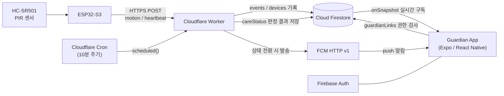

# 별일없지 (Byeolil Eopji)

> 별일 없는 하루를 위해.

멀리 떨어져 지내는 고령의 가족이 평소처럼 생활하면서도, 가족이 일상의 작은 신호를 통해
안심할 수 있는 방법을 고민하며 시작한 프로젝트입니다.

PIR 센서 → ESP32-S3 → Cloudflare Worker → Firestore → 보호자 앱으로 이어지는, 실제
하드웨어로 동작하는 **Physical AI / IoT PoC**입니다.

---

## Why — 문제와 시작한 이유

혼자 생활하는 고령자의 일상을 가족이 지속적으로 확인하기는 어렵습니다. 안부 전화는
부담스럽고, CCTV·웨어러블 기반 모니터링은 "감시"처럼 느껴지기 쉽습니다.

이 프로젝트의 철학은 다음 한 문장입니다.

> **어르신은 평소처럼 생활하고, 기술은 뒤에서 조용히 안전을 보조한다.**

의료 진단이나 응급 판정 서비스가 아니라, 생활 속 움직임 신호를 바탕으로 "오늘 별일
없으신지"를 가족에게 짧게 전달하는 것이 목표입니다.

## What I Built — 현재 PoC 범위

최종 비전(집 안 IoT 센서 + 집 밖 스마트워치 통합)은 여러 단계로 나뉘며, **현재 PoC는 그중
"집 안 생활 신호 감지 → 서버 상태 판정 → 보호자 앱 전달" 구조를 실제 하드웨어로 end-to-end
검증한 단계**입니다. 스마트워치·GPS·복약 관리 등은 아직 이 PoC의 범위 밖입니다 (자세한 범위는
[Current Limitations / Roadmap](#current-limitations--roadmap) 참고).

---

## Verified End-to-End Pipeline

실제 사람의 움직임에서 보호자 앱까지 전체 경로를 검증했습니다.

```text
사람의 움직임
   ↓
HC-SR501 PIR
   ↓
ESP32-S3
   ↓ Wi-Fi / HTTPS
Cloudflare Worker
   ↓
Cloud Firestore
   ↓ Realtime
Guardian App
```

사람이 센서 앞에서 움직이면 몇 초 안에 보호자 앱에 "활동이 확인됐어요"가 반영되는 것까지
실기기로 확인했습니다. ESP32는 Firestore에 직접 연결하지 않고 항상 Cloudflare Worker를
거치며, 이는 하드웨어에 Firebase 인증 정보를 두지 않기 위한 구조입니다.

같은 하드웨어의 heartbeat로 기기 상태(ONLINE/OFFLINE)도 함께 판정하고, Cloudflare Cron이
주기적으로 사람 상태(NORMAL/CHECK/EMERGENCY)와 기기 상태를 재평가합니다. 상태가 전환되면
FCM으로 보호자에게 알림이 전달되며, **복귀 전환과 "CHECK + 기기 오프라인" 동시 전환에서
Android 실기기 알림 수신까지 확인했습니다.**

---

## 실제 화면 / Demo

<!-- TODO: 아래 위치에 실제 캡처/사진을 추가합니다.
     - ESP32-S3 + HC-SR501 배선/브레드보드 실물 사진
     - Guardian Home 화면 스크린샷 (Galaxy S24)
     - Today Timeline 화면 스크린샷
     - 실제 움직임 → 앱 반영까지의 데모 GIF 또는 짧은 영상
-->

---

## 실제 구현 기능

| 기능 | 상태 | 비고 |
| --- | --- | --- |
| PIR motion detection | 구현 · 실기기 검증 완료 | HC-SR501 → GPIO4 상승 에지 → `handlePir()` |
| ESP32 heartbeat | 구현 · 실기기 검증 완료 | 기기 생존 신호, 전원 차단/재연결 왕복 확인 |
| Worker event ingestion | 구현 · 배포/hosted 검증 완료 | `/ingest-device-event`, device key 인증 |
| Worker → Firestore OAuth | 구현 완료 | 서비스 계정 기반 인증 요청 (REST API) |
| Firestore realtime sync | 구현 · 검증 완료 | `onSnapshot` 단일 구독, 앱 재시작 후 persistence 확인 |
| Firebase Guardian Auth | 구현 완료 | 보호자 로그인 |
| guardianLinks authorization | 구현 완료 | 보호자 ↔ 보호대상 연결/권한 모델 |
| 서버측 NORMAL/CHECK/EMERGENCY 판정 | 구현 · 부분 실기기 검증 | NORMAL/CHECK는 실기기 검증, EMERGENCY/SOS는 자동 테스트만 |
| ONLINE/OFFLINE 기기 상태 판정 | 구현 · 실기기 검증 완료 | heartbeat 기준 판정, 사람 축과 독립 |
| Cloudflare Cron 서버 평가 | 구현 · production 자동 실행 확인 | 10분 주기, 수동 실행 없이 자동 갱신 관측 |
| FCM 상태 전환 알림 | 구현 · 실기기 수신 확인 | 복귀 전환, CHECK+오프라인 동시 전환에서 확인 |
| Firestore Security Rules | hardening 완료 | `isGuardianOf()` 기반 read 권한, 클라이언트 write 차단 |
| Guardian Home | 구현 완료 | 오늘의 안부 / 한눈에 보기 / 오늘의 흐름 |
| Today Timeline | 구현 완료 | 오늘 실제 이벤트 + empty state |

> 표에 없는 세부 파일 경로와 검증 로그는 [`docs/BUILD_LOG.md`](docs/BUILD_LOG.md)에 있습니다.

---

## System Architecture



- ESP32는 Firestore에 직접 접근하지 않고 항상 Cloudflare Worker를 경유합니다.
- 사람 상태(NORMAL/CHECK/EMERGENCY)와 기기 상태(ONLINE/OFFLINE)는 서로 독립적으로
  판정되어, 기기 연결 문제가 "사람 위험"처럼 표시되지 않습니다.
- Firestore Security Rules는 `guardianLinks`로 연결된 보호자만 해당 보호대상 데이터를
  읽을 수 있도록 제한합니다.

---

## Engineering — 내가 구현한 범위

1인 개발 PoC로, 하드웨어 펌웨어부터 서버·모바일 앱까지 전 영역을 직접 구현했습니다.

| 영역 | 내용 |
| --- | --- |
| Hardware / Firmware | ESP32-S3 + HC-SR501 배선, Arduino 펌웨어(모션 감지 · 쿨다운 · heartbeat · Wi-Fi 재연결) |
| Edge Backend | Cloudflare Worker (이벤트 ingest, heartbeat, Cron 기반 상태 평가, FCM 발송) |
| Firebase / Security | Firestore 스키마 설계, Firebase Auth 연동, guardianLinks 권한 모델, Security Rules 작성 |
| Mobile App | Expo/React Native 보호자 앱 (Home / Timeline / 실시간 구독 / 상태 표시 UI) |
| Testing / E2E Verification | 순수 함수 단위의 자체 스모크 테스트, 정적 규칙/펌웨어 검사, 실기기 E2E 수동 검증 |

이 프로젝트는 팀 프로젝트가 아니며, 위 표의 모든 항목을 단독으로 설계·구현·검증했습니다.

---

## Tech Stack

- **Client**: Expo (SDK 57) / React Native / React, TypeScript (strict), expo-router, zustand
- **Backend**: Firebase (Firestore, Auth) — Firebase JS SDK
- **Edge**: Cloudflare Workers, Cloudflare Cron Triggers
- **Push**: FCM HTTP v1 (자체 서명 RS256 JWT, Web Crypto)
- **Hardware**: ESP32-S3, HC-SR501 PIR 센서 (Arduino/C++)
- **Testing**: Node 내장 실행 기반 자체 스모크 테스트 (별도 테스트 프레임워크 없음)

---

## Safety / Design Principle

`NORMAL` / `CHECK` / `EMERGENCY`는 **의료 진단이나 응급 확정 판정이 아니라, 생활 움직임
신호를 기반으로 한 규칙 기반(rule-based) 상태 분류**입니다. 예를 들어 일정 시간 활동이
감지되지 않으면 `CHECK`로 분류되는 식이며, 실제 응급 상황 여부를 시스템이 판단하거나
확정하지 않습니다. 최종 판단과 대응은 항상 보호자가 합니다.

---

## Current Limitations / Roadmap

현재 이 PoC에 **구현되어 있지 않은** 범위입니다.

- Wear OS / Galaxy Watch 연동
- AI/ML 기반 이상 패턴 탐지, 낙상 감지 — 현재는 **규칙 기반(threshold) 판정만** 존재하며,
  AI/ML 요소는 전혀 없습니다.
- 복약 스케줄링/관리 기능 (이벤트 타입만 정의되어 있고 실제 기능 없음)
- GPS 기반 위치 추적
- 다중 센서·다중 가정 대상 production 배포
- 119 자동 신고 연동

향후 방향은, 지금처럼 수집되는 생활 신호 데이터가 누적되면 이를 바탕으로 **규칙 기반
판정을 AI 기반 이상 패턴 탐지로 점진적으로 발전시키는 것**을 목표로 하고 있습니다. 현재는
설계 방향일 뿐 구현되어 있지 않습니다.

---

## Development / Running Locally

```bash
npm install
cp .env.example .env     # Firebase 값 입력 (없으면 In-Memory 목업 모드로 자동 폴백)
npm start
```

```bash
npm run typecheck    # tsc --noEmit
npm run lint          # eslint (expo config)
npm run test:smoke   # 자체 스모크 테스트
```

서버(Cloudflare Worker)·펌웨어 설정은 각각 `server/cloudflare-worker/README.md`,
`firmware/esp32-pir/README.md`를 참고하세요.

---

## Engineering Log

각 Phase별 상세 구현 과정, 실기기 검증 로그, 스모크 테스트 수치, Firestore 스키마 등 개발
과정 전체 기록은 [`docs/BUILD_LOG.md`](docs/BUILD_LOG.md)에 있습니다.
